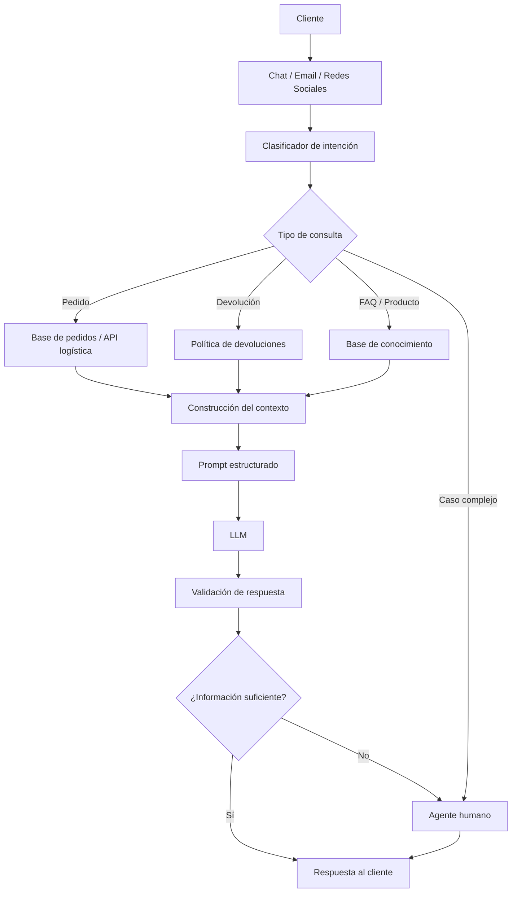
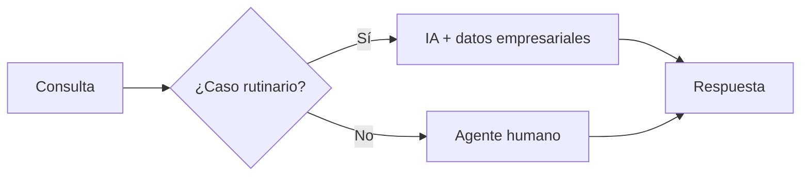

# Taller Práctico #1 — Optimización de la Atención al Cliente en EcoMarket

## Caso de Estudio: IA Generativa para una Empresa de E-commerce

**Proyecto académico:** Taller Práctico #1  
**Empresa del caso:** EcoMarket  
**Tema:** Optimización de la atención al cliente mediante Inteligencia Artificial Generativa  
**Repositorio:** Solución completa de las tres fases del taller

---

## 1. Introducción

EcoMarket es una empresa de comercio electrónico enfocada en la venta de productos sostenibles. Debido a su rápido crecimiento, el área de atención al cliente recibe miles de consultas diarias a través de chat, correo electrónico y redes sociales.

El caso plantea que aproximadamente:

- **80 % de las consultas son repetitivas**, principalmente relacionadas con:
  - estado de pedidos;
  - devoluciones;
  - características de productos.

- **20 % de las consultas son más complejas**, por ejemplo:
  - quejas;
  - problemas técnicos;
  - sugerencias;
  - situaciones que requieren empatía e intervención humana.

Además, el tiempo promedio de respuesta actual es de **24 horas**, generando un impacto negativo sobre la satisfacción del cliente.

El objetivo de este taller es diseñar una solución de **IA generativa** capaz de acelerar y mejorar la calidad de las respuestas del servicio de atención al cliente.

---

# 2. Objetivos del Proyecto

## 2.1 Objetivo general

Diseñar una solución híbrida basada en Inteligencia Artificial Generativa para mejorar la velocidad, calidad, escalabilidad y consistencia del servicio de atención al cliente de EcoMarket.

## 2.2 Objetivos específicos

1. Seleccionar y justificar un modelo de IA generativa adecuado.
2. Diseñar una arquitectura que integre el modelo con información empresarial.
3. Identificar fortalezas, limitaciones y riesgos éticos.
4. Diseñar prompts efectivos para consultas de pedidos y devoluciones.
5. Construir una base simulada de pedidos.
6. Implementar una solución ejecutable en Python.
7. Permitir la integración opcional con un modelo local mediante Ollama.
8. Incorporar mecanismos de escalamiento a agentes humanos.

---

# 3. Fase 1 — Selección y Justificación del Modelo de IA

## 3.1 Modelo seleccionado

Se propone una **arquitectura híbrida de Inteligencia Artificial Generativa**.

La solución combina:

- un modelo de lenguaje;
- datos estructurados de EcoMarket;
- reglas empresariales;
- clasificación de intención;
- recuperación de información;
- supervisión humana.

La elección responde a que EcoMarket necesita simultáneamente:

- automatizar consultas repetitivas;
- mantener precisión en información de pedidos;
- proporcionar respuestas naturales;
- reducir costos;
- escalar el servicio;
- conservar intervención humana para casos complejos.

---

## 3.2 ¿Por qué una solución híbrida?

Un LLM general puede generar respuestas fluidas, pero no debería inventar el estado de un pedido, una fecha de entrega o una política de devolución.

Por ejemplo, ante la pregunta:

> ¿Dónde está mi pedido EM-1003?

el sistema no debería responder utilizando únicamente conocimiento generativo.

Debe consultar primero una fuente confiable.

Por tanto, se adopta el principio:

> **El LLM genera el lenguaje; los sistemas empresariales proporcionan los hechos.**

---

# 4. Arquitectura Propuesta



---

## 4.1 Componentes de la arquitectura

### 1. Canales de atención

La solución puede integrarse con:

- chat web;
- correo electrónico;
- redes sociales;
- aplicaciones móviles.

### 2. Clasificador de intención

Determina el objetivo principal de la consulta.

Ejemplos:

- estado del pedido;
- devolución;
- producto;
- garantía;
- disponibilidad;
- queja;
- solicitud de agente humano.

### 3. Fuente empresarial

En una implementación real, el asistente debería consultar:

- CRM;
- base de pedidos;
- inventario;
- logística;
- catálogo;
- políticas;
- base de conocimiento.

### 4. Modelo generativo

El modelo genera la respuesta utilizando el contexto proporcionado.

### 5. Human-in-the-Loop

Los casos ambiguos, críticos o sensibles se transfieren a un agente humano.

---

# 5. Justificación de la Selección

## 5.1 Precisión

Las consultas relacionadas con pedidos requieren información exacta.

El modelo no debe inventar:

- estado;
- fecha;
- transportadora;
- precio;
- disponibilidad;
- enlace de seguimiento.

Por ello, estos datos se obtienen desde fuentes empresariales.

---

## 5.2 Calidad de respuesta

La IA puede transformar datos estructurados en lenguaje natural.

Ejemplo:

### Respuesta estructurada

```text
PEDIDO: EM-1003
ESTADO: RETRASADO
ENTREGA: 2026-09-26
```

### Respuesta generativa

> Lamentamos el retraso de tu pedido EM-1003. Actualmente continúa en tránsito y la fecha estimada de entrega es el 26 de septiembre de 2026.

La segunda opción ofrece una experiencia más natural.

---

## 5.3 Escalabilidad

La automatización permite manejar múltiples conversaciones simultáneamente.

Esto resulta especialmente importante porque EcoMarket recibe miles de solicitudes diarias.

---

## 5.4 Costo

La arquitectura híbrida permite distribuir las consultas.

Por ejemplo:

```text
Consulta sencilla
        ↓
Reglas / modelo pequeño
        ↓
Respuesta

Consulta que requiere generación
        ↓
LLM

Caso complejo
        ↓
Agente humano
```

Esto evita procesar absolutamente todas las solicitudes utilizando el modelo más costoso.

---

## 5.5 Integración

La solución puede integrarse progresivamente mediante APIs sin reemplazar los sistemas actuales.

---

# 6. Fase 2 — Fortalezas, Limitaciones y Riesgos Éticos

## 6.1 Fortalezas

### Reducción del tiempo de respuesta

Muchas consultas pueden atenderse en segundos en lugar de esperar hasta 24 horas.

### Disponibilidad 24/7

La IA puede funcionar fuera del horario de atención tradicional.

### Automatización de consultas repetitivas

La mayor parte de las solicitudes frecuentes puede procesarse automáticamente.

### Escalabilidad

Permite atender múltiples usuarios simultáneamente.

### Consistencia

Las respuestas pueden alinearse con las políticas oficiales.

### Personalización

El sistema puede utilizar información autorizada del cliente para contextualizar la respuesta.

### Apoyo al personal

La IA también puede asistir a agentes humanos mediante:

- resúmenes;
- recuperación de información;
- clasificación;
- propuestas de respuesta.

---

# 7. Limitaciones

## 7.1 Falta de comprensión humana real

Un modelo puede generar lenguaje empático, pero no posee empatía humana.

## 7.2 Dependencia de los datos

Si la base empresarial es incorrecta, la respuesta también puede ser incorrecta.

## 7.3 Dependencia tecnológica

La solución puede depender de:

- servicios externos;
- APIs;
- conectividad;
- servidores;
- modelos.

## 7.4 Costos operativos

Deben considerarse:

- infraestructura;
- almacenamiento;
- mantenimiento;
- inferencia;
- monitoreo;
- seguridad.

---

# 8. Riesgos Éticos

## 8.1 Privacidad de datos

El sistema podría procesar:

- nombre;
- correo;
- dirección;
- historial de compras;
- número de pedido.

Principio recomendado:

> **La IA debe recibir únicamente los datos estrictamente necesarios para completar la tarea.**

Controles propuestos:

- autenticación;
- autorización;
- cifrado;
- minimización;
- registro de accesos;
- políticas de retención;
- anonimización cuando sea posible.

---

## 8.2 Alucinaciones

Una alucinación ocurre cuando el modelo genera información que parece válida, pero no se encuentra respaldada por los datos proporcionados.

Ejemplo incorrecto:

> Tu pedido llegará mañana.

si el sistema no dispone de esa información.

Control principal:

```text
Sin información verificable
        ↓
No inventar
        ↓
Escalar o informar falta de datos
```

---

## 8.3 Sesgo

Los modelos pueden reflejar sesgos presentes en sus datos.

Se recomienda:

- pruebas periódicas;
- auditorías;
- revisión humana;
- evaluación de respuestas;
- reglas explícitas de comportamiento.

---

## 8.4 Impacto laboral

La propuesta no busca eliminar el trabajo humano.

Se adopta un enfoque de **IA aumentativa**:

```text
IA
→ consultas repetitivas
→ clasificación
→ resumen
→ recuperación de información

Humano
→ quejas
→ negociación
→ excepciones
→ situaciones sensibles
→ problemas complejos
```

---

# 9. Matriz de Riesgos

| Riesgo | Probabilidad | Impacto | Prioridad | Mitigación |
|---|---:|---:|---|---|
| Exposición de datos personales | Media | Muy alto | Crítica | Autenticación, cifrado, minimización |
| Alucinaciones | Alta | Alto | Crítica | Contexto confiable y reglas |
| Información desactualizada | Media | Alto | Alta | Sincronización con fuentes oficiales |
| Sesgos | Media | Alto | Alta | Pruebas y auditorías |
| Falta de empatía | Media | Media | Media | Escalamiento humano |
| Dependencia tecnológica | Media | Media | Media | Monitoreo y redundancia |
| Impacto laboral | Media | Alto | Alta | IA como apoyo, reentrenamiento |

---

# 10. Principios Éticos del Sistema

La solución propuesta sigue cinco principios:

1. **Transparencia**
2. **Privacidad**
3. **Supervisión humana**
4. **Veracidad**
5. **Responsabilidad**

---

# 11. Fase 3 — Ingeniería de Prompts

## 11.1 Objetivo

Demostrar cómo el diseño del prompt afecta la calidad de la respuesta.

Se implementan dos escenarios:

1. Consulta de estado del pedido.
2. Devolución de producto.

---

# 12. Estructura de Ingeniería de Prompts

Los prompts utilizan:

```text
ROL
+
OBJETIVO
+
REGLAS
+
CONTEXTO
+
PREGUNTA
+
FORMATO DE RESPUESTA
+
ESCALAMIENTO
```

---

# 13. Prompt Básico vs Prompt Mejorado

## Prompt básico

```text
Dame el estado del pedido EM-1003.
```

Problemas:

- no suministra contexto;
- no define fuente;
- no limita alucinaciones;
- no define tono;
- no define escalamiento.

---

## Prompt mejorado

```text
ROL:
Actúa como un agente de servicio al cliente de EcoMarket,
amable, claro y preciso.

OBJETIVO:
Responder la consulta sobre el estado de un pedido.

REGLAS:
1. Usa exclusivamente los datos del contexto.
2. No inventes estados, fechas, transportadoras ni enlaces.
3. Si falta un dato, indícalo.
4. Si existe retraso, ofrece una disculpa breve.
5. Incluye fecha de entrega cuando exista.
6. Incluye enlace de seguimiento cuando exista.
7. Si no puedes responder, escala el caso.

CONTEXTO:
Número: EM-1003
Estado: Retrasado
Transportadora: EcoExpress
Entrega estimada: 2026-09-26

PREGUNTA:
¿Cuál es el estado de mi pedido?
```

---

# 14. Base Simulada de Pedidos

El archivo:

```text
data/orders.json
```

contiene **12 pedidos**.

Cada registro incluye:

- número de seguimiento;
- cliente;
- producto;
- categoría;
- estado;
- transportadora;
- fecha estimada;
- enlace;
- razón de retraso.

Ejemplo:

```json
{
  "tracking_number": "EM-1003",
  "customer_name": "Laura Gómez",
  "product": "Café orgánico 500 g",
  "category": "perecedero",
  "status": "Retrasado",
  "carrier": "EcoExpress",
  "estimated_delivery": "2026-09-26",
  "tracking_url": "https://tracking.example/EM-1003",
  "delay_reason": "Demora logística en el centro de distribución"
}
```

---

# 15. Política de Devoluciones

La política se encuentra en:

```text
data/return_policy.json
```

Las categorías consideradas incluyen:

- perecederos;
- higiene;
- textiles;
- papelería;
- hogar reutilizable;
- jardinería;
- limpieza.

---

# 16. Reglas de Devolución

## Productos perecederos

No se aceptan como devolución ordinaria.

## Productos de higiene

No se aceptan si fueron abiertos o usados.

## Productos retornables

Pueden pasar a validación siempre que cumplan:

- plazo;
- condiciones;
- estado del producto;
- empaque cuando aplique.

## Casos ambiguos

Se escalan a un agente humano.

---

# 17. Estructura del Proyecto

```text
Taller1-EcoMarket-IA-Generativa/
│
├── README.md
├── FASE_1.md
├── FASE_2.md
├── FASE_3.md
├── app.py
├── prompts.py
├── services.py
├── ollama_client.py
├── requirements.txt
├── .gitignore
│
├── data/
│   ├── orders.json
│   └── return_policy.json
│
└── tests/
    ├── __init__.py
    └── test_services.py
```

---

# 18. Requisitos

- Python 3.10 o superior.
- Opcionalmente Ollama para ejecución con LLM local.

El proyecto base utiliza la biblioteca estándar de Python.

---

# 19. Ejecución

## 19.1 Consulta de pedido

```bash
python app.py order EM-1001
```

Pedido retrasado:

```bash
python app.py order EM-1003
```

---

## 19.2 Devolución

La aplicación genera una respuesta determinística de respaldo incluso sin Ollama. Si se usa `--llm`, el mismo contexto y la política se envían al modelo generativo.

Producto retornable:

```bash
python app.py return EM-1010
```

Producto perecedero:

```bash
python app.py return EM-1003
```

Producto de higiene abierto:

```bash
python app.py return EM-1002 --opened
```

---

## 19.3 Modo interactivo

```bash
python app.py interactive
```

---

# 20. Ejecución con Ollama

Modelo sugerido:

```bash
ollama pull phi3:mini
```

Consulta:

```bash
python app.py --llm order EM-1003
```

Devolución:

```bash
python app.py --llm return EM-1002 --opened
```

También puede utilizarse otro modelo:

```bash
python app.py --llm --model llama3.1:8b order EM-1003
```

---

# 21. Pruebas Unitarias

Ejecutar:

```bash
python -m unittest discover -s tests -v
```

Pruebas implementadas:

1. Pedido existente.
2. Pedido inexistente.
3. Producto perecedero.
4. Producto de higiene abierto.
5. Producto textil retornable.
6. Respuesta determinística de devolución no vacía y coherente.

Resultado esperado:

```text
Ran 6 tests

OK
```

---

# 22. Ejemplo de Resultado — Pedido Retrasado

Comando:

```bash
python app.py order EM-1003
```

Resultado:

```text
El pedido EM-1003 está actualmente en estado: Retrasado.
La fecha estimada de entrega es 2026-09-26.
Transportadora: EcoExpress.
Lamentamos el retraso.
Motivo registrado: Demora logística en el centro de distribución.
```

---

# 23. Ejemplo de Resultado — Producto de Higiene

Comando:

```bash
python app.py return EM-1002 --opened
```

Resultado:

```text
Elegible: False

Razón:
Los productos de higiene personal no se aceptan
si fueron abiertos o usados.

Acción:
Explicar la restricción de higiene y ofrecer revisión
humana si el producto llegó defectuoso.
```

---

# 24. Control de Alucinaciones

El proyecto incorpora las siguientes reglas:

```text
Usa exclusivamente los datos del CONTEXTO.
```

```text
No inventes estados, fechas, transportadoras,
enlaces ni motivos.
```

```text
Si no existe información suficiente,
escala el caso a un agente humano.
```

---

# 25. Human-in-the-Loop

La solución incorpora supervisión humana.



---

# 26. Indicadores Propuestos

Para evaluar una implementación real se recomienda medir:

- tiempo promedio de respuesta;
- tasa de resolución automática;
- tasa de escalamiento;
- satisfacción del cliente;
- tasa de respuestas incorrectas;
- número de alucinaciones;
- incidentes de privacidad;
- costo por conversación;
- tiempo promedio de resolución.

---

# 27. Resultado Esperado

La arquitectura debe permitir:

```text
Menor tiempo de respuesta
+
Mayor disponibilidad
+
Mayor consistencia
+
Escalabilidad
+
Mejor experiencia del cliente
+
Supervisión humana
```

---

# 28. Conclusiones

El análisis del caso EcoMarket demuestra que una arquitectura híbrida es más adecuada que depender exclusivamente de un modelo generativo.

El LLM aporta:

- comprensión de lenguaje;
- generación natural;
- flexibilidad;
- capacidad conversacional.

Mientras que los sistemas empresariales aportan:

- precisión;
- trazabilidad;
- información actualizada;
- control.

La solución propuesta se resume en:

> **IA para automatizar, datos para verificar y humanos para supervisar.**

El diseño de prompts constituye un componente fundamental para controlar el comportamiento del modelo.

El proyecto demuestra que:

1. Un prompt estructurado reduce ambigüedad.
2. Los datos empresariales deben ser la fuente de verdad.
3. Las alucinaciones deben gestionarse explícitamente.
4. Los casos complejos requieren supervisión humana.
5. La IA debe complementar al trabajador y no utilizarse únicamente como mecanismo de sustitución.
6. La privacidad debe integrarse desde el diseño.
7. Una arquitectura modular facilita la evolución hacia una solución empresarial real.

---

# 29. Posibles Mejoras Futuras

Como evolución del prototipo podrían incorporarse:

- API REST con FastAPI;
- interfaz web con Streamlit;
- RAG;
- base vectorial;
- autenticación;
- integración con CRM;
- integración logística;
- clasificación automática de intención;
- análisis de sentimiento;
- registro de conversaciones;
- evaluación automática de calidad;
- monitoreo de alucinaciones;
- métricas de tokens y costo;
- soporte multimodelo.

---

# 30. Evidencias Recomendadas para la Entrega

Se recomienda incluir capturas de pantalla de:

```bash
python app.py order EM-1001
python app.py order EM-1003
python app.py return EM-1010
python app.py return EM-1003
python app.py return EM-1002 --opened
python -m unittest discover -s tests -v
```

Opcionalmente:

```bash
python app.py --llm order EM-1003
```

---

# 31. Forma de Entrega

El proyecto está preparado para publicarse como un repositorio de GitHub.

Una vez cargado, el enlace tendrá una forma similar a:

```text
https://github.com/USUARIO/Taller1-EcoMarket-IA-Generativa
```

Ese enlace puede utilizarse como entrega final del taller.

---

## Licencia académica

Proyecto desarrollado exclusivamente con fines educativos para el Taller Práctico #1 sobre Inteligencia Artificial Generativa aplicada al servicio al cliente.
